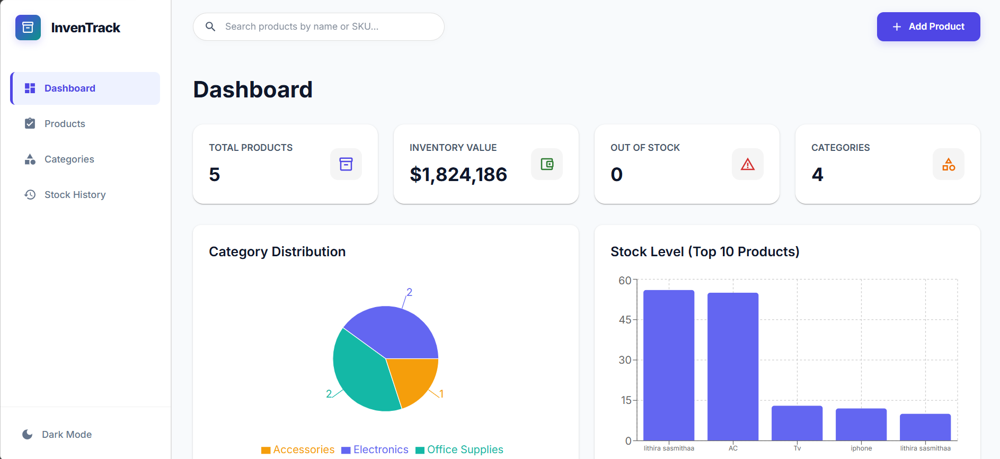
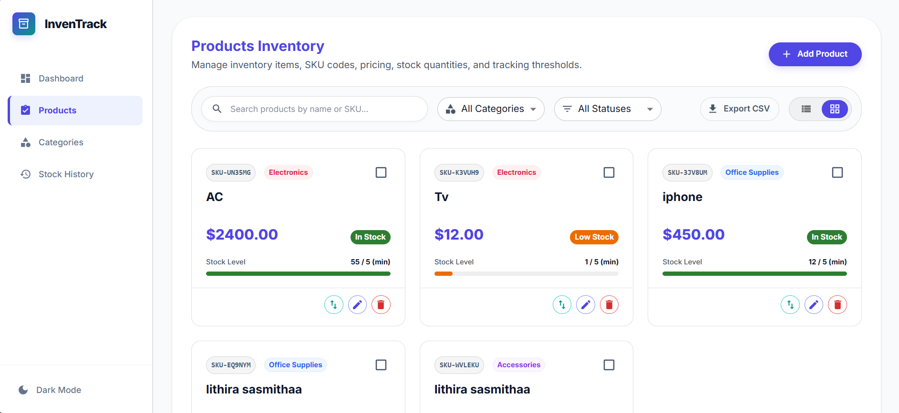
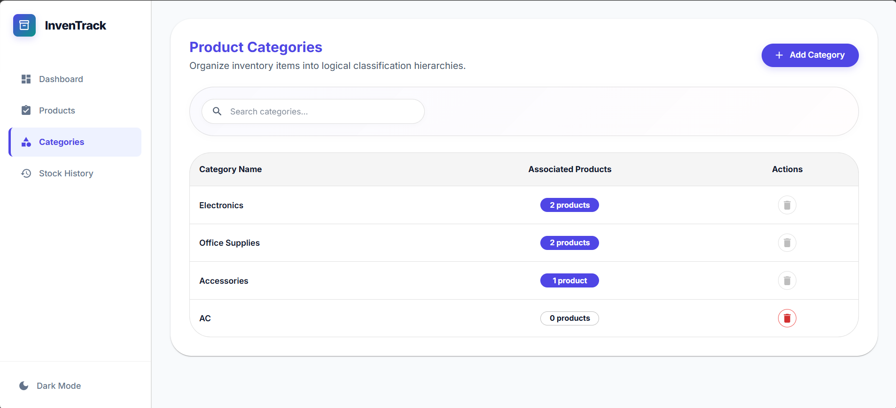
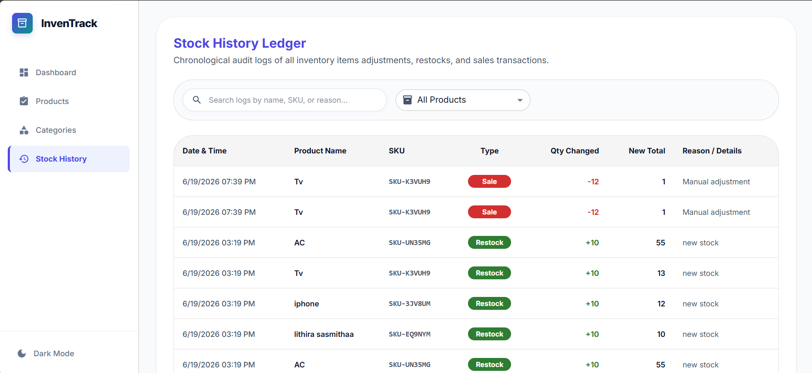

# 📦 Inventory Management System (IMS)

A modern, responsive, and visually stunning client-side **Inventory Management System (IMS)** built with React, Material-UI (MUI) v6, and Tailwind CSS. The application is designed to be completely client-side, using `localStorage` for seamless state persistence, making it incredibly easy to run and test without requiring database setups.

---

## 🚀 Live Walkthrough & Screenshots

### 📊 Interactive Dashboard

Overview of the current inventory health, showing total products, net worth value, out-of-stock items, categories, low-stock alerts, and distribution charts.


### 🧺 Products Inventory Management

Comprehensive item registry showing SKU codes, pricing, stock levels, and alert thresholds. Includes card/table toggle, sorting, search, category filtering, and bulk restock actions.


### 📁 Product Categories

Hierarchy management for inventory sorting. Prevents deletions of categories that currently have products assigned to maintain data integrity.


### 📜 Stock History Log

A chronological ledger/audit trail logging every stock inbound, sale, or manual adjustment with reasons and timestamps.


---

## ✨ Features

- **💡 Dark & Light Mode Theme**: Persistent interface modes utilizing MUI's theme engine with seamless transitions.
- **📊 Real-time Dashboard**:
  - Live metric counters (Total Products, Total Value, Out of Stock, Categories).
  - Low-stock visual warnings to trigger quick replenishment.
  - Interactive Recharts visualizing **Category Stock Distribution** (Pie Chart) and **Top 10 Stock Levels** (Bar Chart).
- **📋 Product Inventory Management (CRUD)**:
  - Add, edit, single-delete, and bulk-delete products.
  - Interactive Search (by Product Name or SKU code).
  - Filters for Categories and Stock Status (In-Stock vs Out-of-Stock).
  - Flexible **Table View** and **Grid/Card View** options.
  - CSV Export support for spreadsheets.
- **⚡ Stock Adjustments**:
  - Direct Stock In (Restocking) & Stock Out (Sales/Losses) with mandatory reason fields.
  - Bulk stock restocking capability for multiple products at once.
- **📂 Category Management**:
  - Full CRUD operations for product taxonomy.
  - Integrated validation preventing deletion of categories containing active products.
- **📜 Stock Ledger (Audit Log)**:
  - Full transactional history keeping track of product changes, quantities, new levels, actions (STOCK_IN/STOCK_OUT), reasons, and exact timestamps.

---

## 🛠️ Tech Stack & Dependencies

- **Frontend Core**: [React 19](https://react.dev/) & [React Router v7](https://reactrouter.com/)
- **UI Component Library**: [Material-UI (MUI) v6](https://mui.com/)
- **Styling Framework**: [Tailwind CSS v3](https://tailwindcss.com/)
- **Charts & Data Visualization**: [Recharts v3](https://recharts.org/)
- **Form Handling & Validation**: [Formik](https://formik.org/) & [Yup](https://github.com/jquense/yup)
- **Data Exporting**: [PapaParse](https://www.papaparse.com/) (CSV Helper)
- **State Management**: React Context API with persistent custom local storage hooks.

---

## ⚙️ Setup & Installation Instructions

Follow these simple steps to run the application locally on your machine:

### Prerequisites

Make sure you have [Node.js](https://nodejs.org/) installed (v16.0.0 or higher recommended) along with `npm`.

### Installation Steps

1. **Clone the Repository:**

   ```bash
   git clone https://github.com/Lithira-Sasmitha/Inventory_Management_System.git
   cd Inventory_Management_System
   ```

2. **Navigate to the Frontend Directory:**

   ```bash
   cd frontend
   ```

3. **Install Dependencies:**

   ```bash
   npm install
   ```

4. **Start the Development Server:**

   ```bash
   npm start
   ```

   The app will run in development mode. Open [http://localhost:3000](http://localhost:3000) to view it in your browser.

5. **Build for Production:**
   If you want to bundle the app for production, run:
   ```bash
   npm run build
   ```
   This will correctly bundle React in production mode and optimize the build for the best performance in the `build` folder.

---

## 📁 Project Structure

```
Inventory_Management_System/
├── frontend/
│   ├── public/                 # Static assets (HTML, Favicon, etc.)
│   ├── src/
│   │   ├── components/         # Shared & Page-specific Components
│   │   │   ├── Categories/     # Category lists, forms, and dialogs
│   │   │   ├── Dashboard/      # Metric cards, pie/bar charts, alerts
│   │   │   ├── Layout/         # Header, Sidebar, and Sidebar toggle components
│   │   │   ├── Products/       # Product list, filters, modals, Forms
│   │   │   ├── StockHistory/   # Transaction ledger tables
│   │   │   └── common/         # Searchbar, Page headers, Entity pages
│   │   ├── constants/          # Application constants
│   │   ├── context/            # InventoryState & Theme context providers
│   │   ├── hooks/              # Custom React hooks (useSearch, useLocalStorage)
│   │   ├── pages/              # Primary route views (Dashboard, Products, Categories, StockHistory)
│   │   ├── utils/              # Export/Import utility helpers
│   │   ├── App.css             # Main stylesheet overrides
│   │   ├── App.js              # Routing and Context definitions
│   │   ├── index.css           # Tailwind CSS directives
│   │   ├── index.js            # App entry point
│   │   └── theme.js            # Light/Dark mode MUI palettes
│   ├── tailwind.config.js      # Tailwind configurations
│   └── package.json            # Node scripts and dependencies
├── screenshots/                # Application screenshots for README.md
└── README.md                   # This root documentation file
```

---
